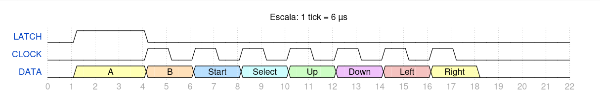
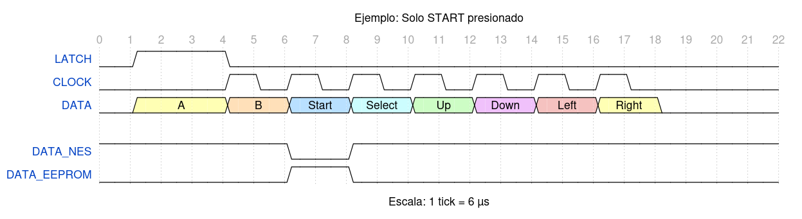

# nes_controller.v

### Master y slave 
En este caso, master es el módulo de la FPGA o el SoC encargado de controlar el NES
Slave es el mando físico del NES 
## Protocolo de Comunicación del NES
Aproximadamente cada 16ms (al manejar 60Hz) se repite lo siguiente: 

Latch es un pulso enviado por master que 'congela' el estado del 4021N interno en el mando físico de la NES. En el momento donde este pulso baja, automáticamente la línea Data revela el valor del primer bit, correspondiente al estado del botón 'A'. Posteriormente, se envia una secuencia de 7 pulsos para relevar los valores correspondientes a los demás botones. 

Sin embargo, el módulo maneja lógica 'inversa': Cuando está oprimido un botón, se obtiene '0' como valor, y cuando no está oprimido, se obtiene '1'. Por lo que cuando la línea Data llega a la FPGA, se le aplica una compuerta NOT. Por ejemplo, si en un ciclo se tiene start presionado: 

### Especificaciones del Protocolo de Comunicaciones 
* El protocolo opera mediante comunicación en serie y síncrona unidireccional
* La FPGA controla las líneas LATCH y CLOCK, y recibe DATA
* Se emplean niveles eléctricos estándar Transistor-Transistor Logic / Low-Voltage Transistor-Transistor Logic (5V o 3.3V), definiendo un umbral lógico bajo en $V_{IL} < 0.8\text{ V}$ y un umbral alto en $V_{IH} > 2.0\text{ V}$.
* DATA funciona con lógica negativa

### Verificación por Software Mediante Máscaras de Bit

| Botón a Verificar | Máscara Binaria | Máscara Hex | Condición en C | Resultado (Ej: Solo START = `0x08`) |
| :--- | :---: | :---: | :--- | :---: |
| **A** | `0000 0001` | `0x01` | `(data & 0x01) != 0` | `0` (Falso) |
| **B** | `0000 0010` | `0x02` | `(data & 0x02) != 0` | `0` (Falso) |
| **Select** | `0000 0100` | `0x04` | `(data & 0x04) != 0` | `0` (Falso) |
| **Start** | `0000 1000` | `0x08` | `(data & 0x08) != 0` | **`1` (Verdadero - Presionado)** |
| **Arriba** | `0001 0000` | `0x10` | `(data & 0x10) != 0` | `0` (Falso) |
| **Abajo** | `0010 0000` | `0x20` | `(data & 0x20) != 0` | `0` (Falso) |
| **Izquierda** | `0100 0000` | `0x40` | `(data & 0x40) != 0` | `0` (Falso) |
| **Derecha** | `1000 0000` | `0x80` | `(data & 0x80) != 0` | `0` (Falso) |

### Mapa de Memoria del Módulo NES (`cores/nes_ctrl/perip_nes.v`)

| Dirección Base | Offset | Nombre de Registro | Tipo | Descripción |
| :---: | :---: | :--- | :---: | :--- |
| `0x450000` | `0x00` | `NES_DATA_REG` | Lectura | Estado de los 8 botones (Lógica Positiva: 1 = Presionado). |
| `0x450004` | `0x04` | `NES_CTRL_REG` | Lectura / Escritura | Control de habilitación del polling automático y disparo manual. |
| `0x450008` | `0x08` | `NES_STATUS_REG` | Lectura | Estado del módulo (1 = Lectura completada, 0 = Bus ocupado). |
| `0x45000C` | `0x0C` | `NES_CLKDIV_REG` | Lectura / Escritura | Divisor de reloj para ajustar los pulsos de CLOCK y LATCH. |

##Funcionamiento Interno del NES

