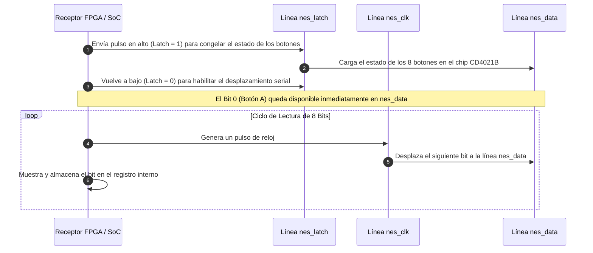
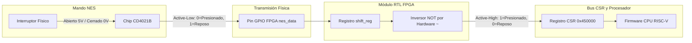
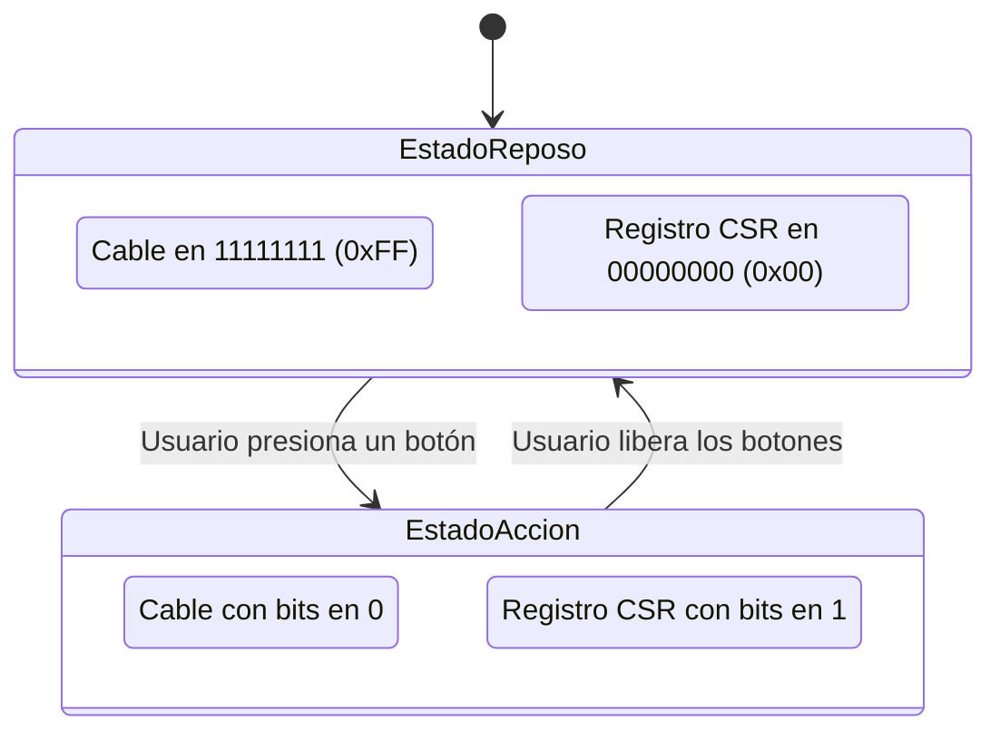
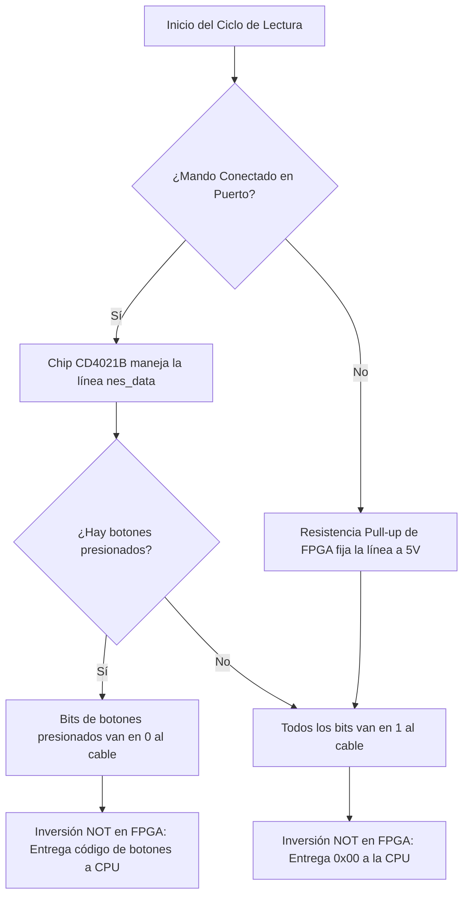
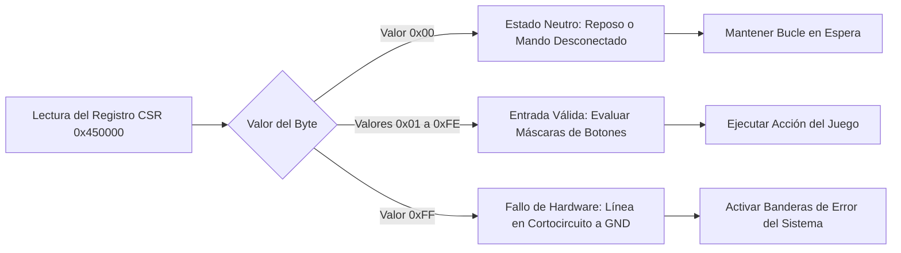

# Definición de Tramas de Datos
## ¿Qué es una trama de datos?
Unidad de información digital estructurada que se transmite a través de un canal físico siguiendo un orden temporal estricto. En el mando de la consola NES, la trama tiene un tamaño fijo de 8 bits (1 Byte), cada uno de los bits representa el estado de un botón específico (cuatro de la cruceta, Select, Start, A y B).

El circuito integrado del mando (un registro de desplazamiento CD4021B) recibe en paralelo el estado de los 8 botones cuando la FPGA envía el pulso de captura Latch. Luego,, el mando transmite dicho estado bit por bit de manera serial a través de Data, sincronizado por los pulsos de reloj enviados desde la FPGA por la línea nes_clk.

---

## Estructura y Mapeo del Byte de Datos

### Explicación del Mapeo de Bits
El propósito de la tabla es mostrar el orden en que se transmiten los bits por la línea física, comenzando con el Bit 0 hasta finalizar con el Bit 7 (MSB).

| Posición de Bit | Botón Asociado | Función del Botón | Orden de Transmisión Serial |
| :--- | :--- | :--- | :--- |
| Bit 0 | Botón A | Acción Principal | Primer bit transmitido en la línea física |
| Bit 1 | Botón B | Acción Secundaria | Segundo bit transmitido en la línea física |
| Bit 2 | Botón Select | Navegación y Menú | Tercer bit transmitido en la línea física |
| Bit 3 | Botón Start | Inicio y Pausa | Cuarto bit transmitido en la línea física |
| Bit 4 | Cruceta Arriba (Up) | Dirección | Quinto bit transmitido en la línea física |
| Bit 5 | Cruceta Abajo (Down) | Dirección | Sexto bit transmitido en la línea física |
| Bit 6 | Cruceta Izquierda (Left) | Dirección | Séptimo bit transmitido en la línea física |
| Bit 7 (MSB) | Cruceta Derecha (Right) | Dirección | Octavo bit transmitido en la línea física |

### Explicación del Diagrama de Secuencia Temporal
Este diagrama en formato Mermaid ilustra el protocolo de tiempo necesario para extraer la trama de datos del mando. Explica el flujo paso a paso: la FPGA activa la señal Latch para tomar la foto de los botones, inhabilita el Latch y luego inicia un ciclo iterativo de 8 pulsos de reloj para recibir secuencialmente cada bit de la trama.

---

# Subtareas de Procesamiento de Tramas

Para integrar esta comunicación en un sistema con procesador (por ejemplo, RISC-V), se deben gestionar cuatro aspectos fundamentales de la trama.

## 1. Polaridad Lógica

Cada botón del mando funciona como un interruptor conectado a tierra (0V). Cuando un botón no se presiona, una resistencia pull-up eleva la línea a +5V (1 lógico). Cuando se presiona, la línea cae a 0V (0 lógico). Esto significa que la trama viaja en el cable con lógica activa en bajo (Active-Low).

Para simplificar el procesamiento en software y evitar que la CPU gaste ciclos invirtiendo los bits, el módulo RTL perip_nes.v de la FPGA incorpora una compuerta NOT por hardware. Así, los datos depositados en el registro CSR 0x450000 quedan en lógica activa en alto (Active-High), donde 1 representa un botón presionado[cite: 1].

### Explicación del Diagrama de Flujo de la Señal
Este diagrama demuestra la ruta física y lógica de la trama de datos desde que el usuario interactúa con el control hasta que la información llega al firmware del procesador.

### Explicación de las Tablas de Polaridad
Las siguientes dos tablas explican cómo se traducen los niveles de voltaje del cable a valores lógicos dentro del registro de memoria de la CPU, desglosando la transformación por etapas de hardware.

| Estado del Botón | Voltaje Medido | Valor en Cable (Active-Low) | Valor en Registro CPU (Active-High)[cite: 1] |
| :--- | :--- | :--- | :--- |
| Reposo (No Presionado) | +5.0 Volts | Bit binario 1 | Bit binario 0[cite: 1] |
| Presionado (Oprimido) | 0.0 Volts (GND) | Bit binario 0 | Bit binario 1[cite: 1] |

| Etapa del Sistema | Dominio de Trabajo | Tipo de Lógica | Representación de Datos |
| :--- | :--- | :--- | :--- |
| Contacto del Mando | Electrónico Físico | Circuito Eléctrico | Abierto (+5V) / Cerrado (0V) |
| Salida CD4021B | Comunicación Serie | Active-Low | 1 = Reposo / 0 = Presionado |
| Entrada GPIO FPGA | Interfaz Digital | Active-Low | 1 = Reposo / 0 = Presionado |
| Bloque Verilog | Procesamiento RTL | Inversión NOT | ~shift_reg en asignación de bus[cite: 1] |
| Registro Memoria | Bus CSR (0x450000) | Active-High | 1 = Presionado / 0 = Reposo[cite: 1] |

---

## 2. Trama de Reposo

Cuando el mando está conectado pero no se presiona ningún botón, las resistencias de elevación mantienen todas las entradas en alto. El mando envía la trama `11111111` (0xFF). 

Al pasar por la compuerta NOT en la FPGA, esta trama se invierte a `00000000` (0x00)[cite: 1]. Esto permite al firmware evaluar simplemente si la lectura del registro es mayor que cero para determinar si hay alguna acción presente.

### Explicación del Diagrama de Estado de Reposo
Este diagrama en Mermaid muestra el comportamiento del sistema según el estado de la trama. Explica cómo la trama cambia de una condición neutra (0x00) a una condición activa cuando el usuario interactúa con los botones.

---

## 3. Trama por Desconexión

Si el mando es retirado del puerto, la línea nes_data queda flotando. La FPGA cuenta con una resistencia pull-up interna activada en la entrada GPIO para evitar ruido eléctrico. 

Esta resistencia fuerza la línea a +5V, generando la misma trama `11111111` que un mando en reposo. Al invertirse en hardware, el procesador lee `0x00`[cite: 1]. De esta forma se evita que una desconexión genere entradas erráticas o falsos disparos en el sistema.

### Explicación del Diagrama de Decisiones del Puerto
Este flujo de decisiones ilustra cómo el circuito reacciona ante la presencia o ausencia del mando físico para formar la trama final recibida por la CPU.

---

## 4. Tabla de Tramas para Casos de Prueba

Las siguientes tablas contienen vectores de prueba esenciales para verificar mediante simulación (como GTKWave) o debugging en software que las tramas se estén decodificando de forma correcta.

### Explicación de las Tablas de Vectores de Prueba
- **Tabla 1 (Botones Individuales):** Muestra el valor en binario y hexadecimal que adopta la trama cuando se activa cada bit por separado.
- **Tabla 2 (Combinaciones Múltiples):** Muestra cómo se comportan los bits de la trama al presionar combinaciones como diagonales o múltiples botones simultáneos (superposición mediante operaciones bitwise OR).
- **Tabla 3 (Matriz de Diagnóstico):** Permite identificar fallas de hardware mediante la inspección de valores anómalos en la trama recibida.

#### Tabla 1: Vectores para Botones Individuales

| Evento de Entrada | Línea Física (nes_data) | Registro CPU Binario (d_out)[cite: 1] | Lectura CPU Hex (0x450000)[cite: 1] | Bit Activo en Registro |
| :--- | :---: | :---: | :---: | :--- |
| Estado de Reposo | 11111111 | 00000000 | 0x00 | Ningún bit activo |
| Presión de Botón A | 11111110 | 00000001 | 0x01 | Bit 0 activo |
| Presión de Botón B | 11111101 | 00000010 | 0x02 | Bit 1 activo |
| Presión de Botón Select | 11111011 | 00000100 | 0x04 | Bit 2 activo |
| Presión de Botón Start | 11110111 | 00001000 | 0x08 | Bit 3 activo |
| Presión Cruceta Arriba | 11101111 | 00010000 | 0x10 | Bit 4 activo |
| Presión Cruceta Abajo | 11011111 | 00100000 | 0x20 | Bit 5 activo |
| Presión Cruceta Izquierda | 10111111 | 01000000 | 0x40 | Bit 6 activo |
| Presión Cruceta Derecha | 01111111 | 10000000 | 0x80 | Bit 7 activo |

#### Tabla 2: Vectores para Combinaciones Múltiples y Diagonales

| Combinación de Entrada | Línea Física (nes_data) | Registro CPU Binario (d_out)[cite: 1] | Lectura CPU Hex (0x450000)[cite: 1] | Máscaras de Bits Aplicadas |
| :--- | :---: | :---: | :---: | :--- |
| Botón A + Botón B | 11111100 | 00000011 | 0x03 | NES_BTN_A \| NES_BTN_B |
| Botón A + Botón Start | 11110110 | 00001001 | 0x09 | NES_BTN_A \| NES_BTN_START |
| Botón B + Botón Select | 11111001 | 00000110 | 0x06 | NES_BTN_B \| NES_BTN_SELECT |
| Diagonal Arriba + Derecha | 01101111 | 10010000 | 0x90 | NES_BTN_UP \| NES_BTN_RIGHT |
| Diagonal Arriba + Izquierda | 10101111 | 01010000 | 0x50 | NES_BTN_UP \| NES_BTN_LEFT |
| Diagonal Abajo + Derecha | 01011111 | 10100000 | 0xA0 | NES_BTN_DOWN \| NES_BTN_RIGHT |
| Diagonal Abajo + Izquierda | 10011111 | 01100000 | 0x60 | NES_BTN_DOWN \| NES_BTN_LEFT |
| Cuatro Botones de Acción | 11110000 | 00001111 | 0x0F | A \| B \| SELECT \| START |
| Todos los Botones Oprimidos | 00000000 | 11111111 | 0xFF | Todos los bits en 1 |

#### Tabla 3: Matriz de Diagnóstico y Evaluación del Puerto

| Estado de la Línea Física | Lectura Bruta (FPGA) | Lectura CPU (0x450000)[cite: 1] | Diagnóstico del Sistema | Acción Sugerida en Firmware |
| :--- | :---: | :---: | :--- | :--- |
| Línea Flotante (Desconectado) | 11111111 | 0x00 | Mando no detectado | Mantener sistema en espera |
| Reposo Normal Conectado | 11111111 | 0x00 | Mando en espera | Continuar bucle principal |
| Cortocircuito Permanente a GND | 00000000 | 0xFF | Fallo de línea física | Generar bandera de error |
| Error de Sincronía en Latch | Datos inestables | Lectura no válida | Error de temporización | Reiniciar secuencia de lectura |

### Explicación del Diagrama de Evaluación de Diagnóstico en Firmware
Este diagrama explica cómo el programa en C lee el byte depositado en la memoria 0x450000 y toma decisiones en el software dependiendo del valor hex devuelto por la trama.

