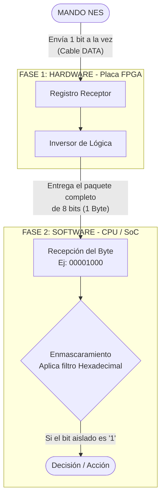

# Lógica de Mapeo y Decodificación del Controlador NES

Este documento detalla cómo se extrae la información de los botones del mando, cómo se agrupa en un vector de 8 bits y cómo el procesador filtra esa información para saber qué botón se presionó. Todo el proceso ocurre en tres etapas lógicas.

---

## 1. Tabla de orden de salida bit por bit

El mando de NES no envía todos los botones al mismo tiempo. Al recibir la orden de `LATCH`, toma una "foto" de qué botones están presionados y luego los envía uno por uno por el cable `DATA` cada vez que recibe un pulso de `CLOCK`. 

El orden de llegada define nuestro mapa:

| Señal que lo envía | Índice en el Vector | Botón correspondiente | Máscara |
| :--- | :--- | :--- | :--- |
| **LATCH** | Bit 0 | A | Hex: `0x01` |
| **CLOCK 1** | Bit 1 | B | Hex: `0x02` |
| **CLOCK 2** | Bit 2 | Select | Hex: `0x04` |
| **CLOCK 3** | Bit 3 | Start | Hex: `0x08` |
| **CLOCK 4** | Bit 4 | Up | Hex: `0x10` |
| **CLOCK 5** | Bit 5 | Down | Hex: `0x20` |
| **CLOCK 6** | Bit 6 | Left | Hex: `0x40` |
| **CLOCK 7** | Bit 7 | Right | Hex: `0x80` |

---

## 2. Diagrama de Flujo de los Datos

El siguiente diagrama muestra cómo se mueven los datos al salir del mando como pulsos individuales, hasta que se convierten en un comando.



## 3. Implementación en Software: Constantes de Enmascaramiento en C

Para aplicar el concepto de enmascaramiento en el código del juego, definimos constantes usando los valores hexadecimales de nuestro mapa.

```c
// 1. Definición de la dirección de memoria asignada al mando NES 

#define NES_PORT_ADDR 0x450000
#define IO_NES        (*((volatile uint32_t *)NES_PORT_ADDR))

// 2. Constantes de enmascaramiento
#define NES_MASK_A      0x01  // Binario: 0000 0001
#define NES_MASK_B      0x02  // Binario: 0000 0010
#define NES_MASK_SELECT 0x04  // Binario: 0000 0100
#define NES_MASK_START  0x08  // Binario: 0000 1000
#define NES_MASK_UP     0x10  // Binario: 0001 0000
#define NES_MASK_DOWN   0x20  // Binario: 0010 0000
#define NES_MASK_LEFT   0x40  // Binario: 0100 0000
#define NES_MASK_RIGHT  0x80  // Binario: 1000 0000
