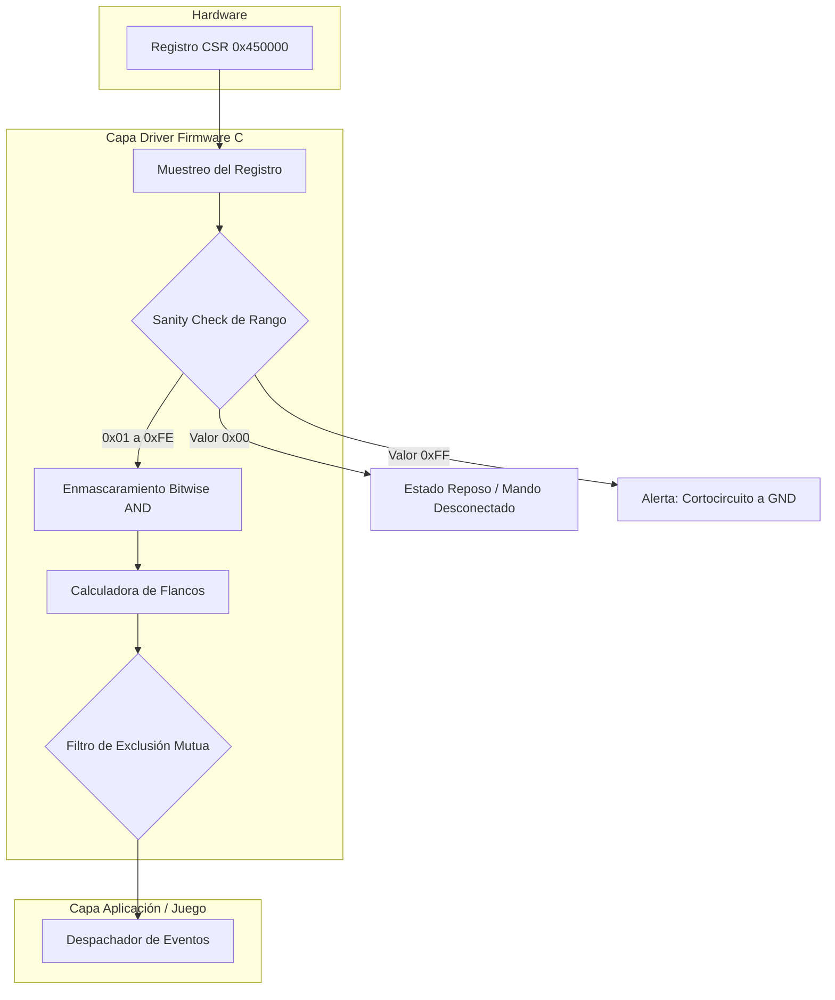
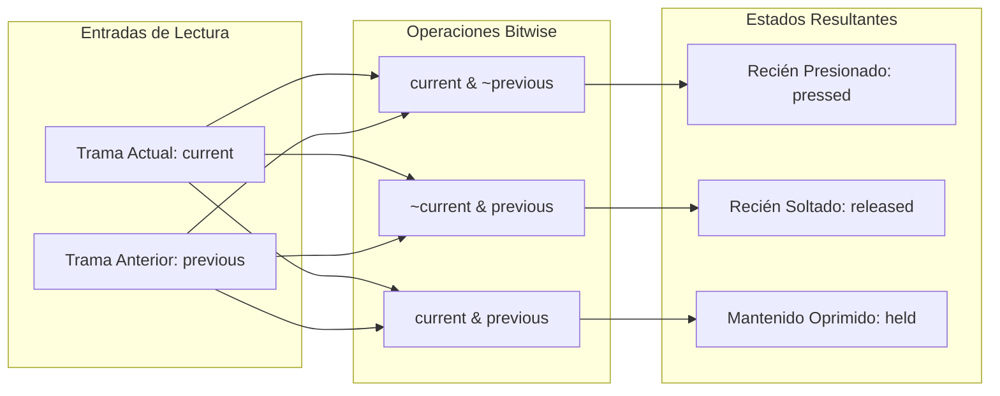
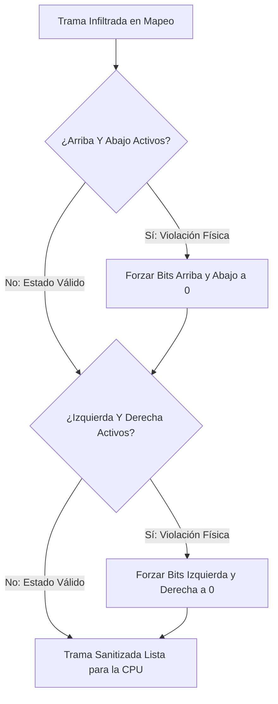

#  Verificación de Botones



---

# Enmascaramiento Bitwise AND

Filtro para aislar la presencia de cada botón dentro del byte recibido.

| Botón | Máscara Hexadecimal | Máscara Binaria | Condición Lógica en C |
| :--- | :---: | :---: | :--- |
| Botón A | `0x01` | `00000001` | `(trama & 0x01) != 0` |
| Botón B | `0x02` | `00000010` | `(trama & 0x02) != 0` |
| Select | `0x04` | `00000100` | `(trama & 0x04) != 0` |
| Start | `0x08` | `00001000` | `(trama & 0x08) != 0` |
| Arriba (Up) | `0x10` | `00010000` | `(trama & 0x10) != 0` |
| Abajo (Down) | `0x20` | `00100000` | `(trama & 0x20) != 0` |
| Izquierda (Left) | `0x40` | `01000000` | `(trama & 0x40) != 0` |
| Derecha (Right) | `0x80` | `10000000` | `(trama & 0x80) != 0` |

---

# Detección de Flancos

Cálculo del cambio de estado mediante la comparación entre la trama del ciclo actual (`current`) y el ciclo previo (`previous`).



---

# Sanitización de Direcciones Opuestas

Corrección de datos inválidos por colisión física en la cruceta (direcciones opuestas simultáneas).



---

# Implementación en C

```c
#include <stdint.h>

#define NES_CSR_ADDR (*(volatile uint8_t*)0x450000)

#define MASK_A      0x01
#define MASK_B      0x02
#define MASK_SELECT 0x04
#define MASK_START  0x08
#define MASK_UP     0x10
#define MASK_DOWN   0x20
#define MASK_LEFT   0x40
#define MASK_RIGHT  0x80

typedef struct {
    uint8_t current;
    uint8_t pressed;
    uint8_t released;
    uint8_t held;
} NES_Controller;

static uint8_t previous_frame = 0;

void nes_update(NES_Controller *pad) {
    uint8_t raw = NES_CSR_ADDR;

    // Sanity Check de Rango
    if (raw == 0xFF) {
        pad->current = 0;
        return;
    }

    // Sanitización de direcciones opuestas
    if ((raw & MASK_UP) && (raw & MASK_DOWN))    raw &= ~(MASK_UP | MASK_DOWN);
    if ((raw & MASK_LEFT) && (raw & MASK_RIGHT)) raw &= ~(MASK_LEFT | MASK_RIGHT);

    // Cálculo de flancos y actualización de estado
    pad->current  = raw;
    pad->pressed  = raw & ~previous_frame;
    pad->released = ~raw & previous_frame;
    pad->held     = raw & previous_frame;

    previous_frame = raw;
}
```
